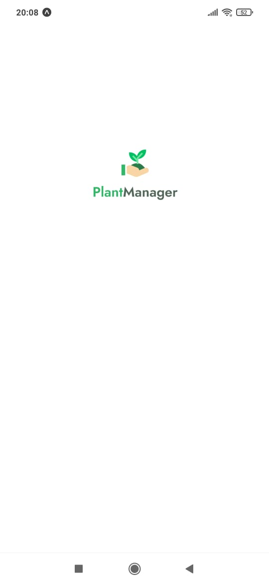
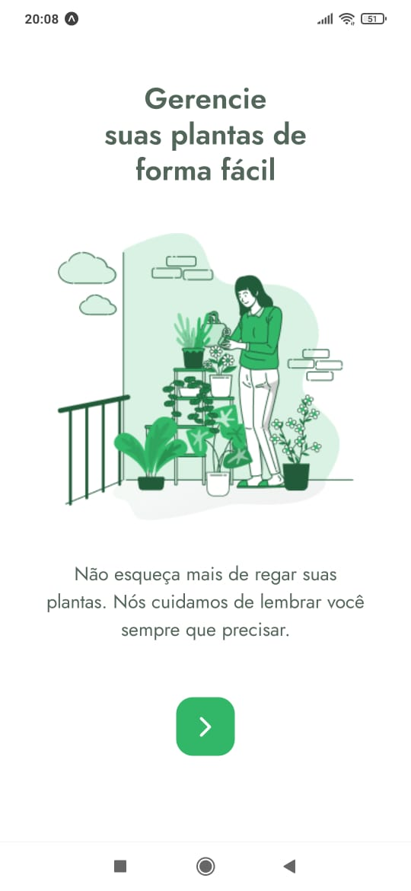
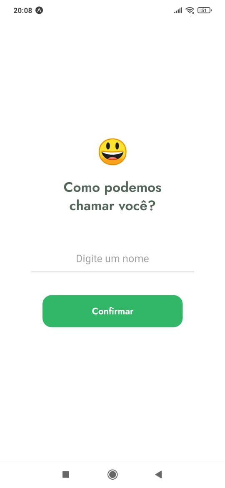
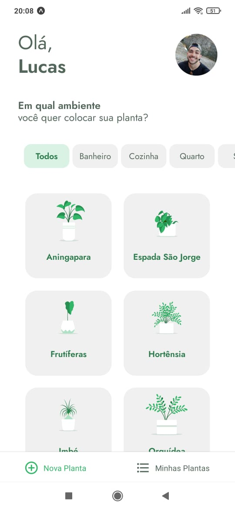
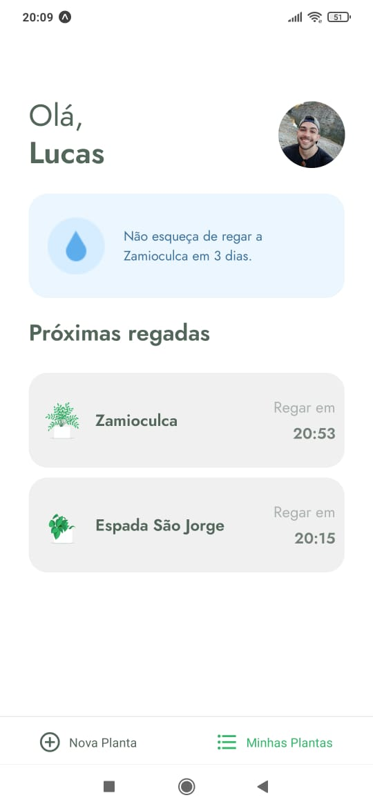

<head>
  <p align="center">
    
    
  </p>
  <p align="center">
    
  </p>
  <h1 align="center">
    PlantManager
  </h1>
</head>

<p align="center">
<a href="#books-descrição-do-projeto">Descrição do Projeto</a>
|
<a href="#computer-tecnologias">Tecnologias</a>
|
<a href="#rocket-execução">Execução</a>
|
<a href="#camera-interfaces-do-app">Interfaces do App</a>
</p>

## :books: Descrição do Projeto

   O PlantManager é um App que permite o cadastro de plantinhas dos usuários, associando-as aos ambientes da casa em que estão distribuídas e lembrando o usuário do horário de regá-las através de notificações no próprio dispositivo.

## :computer: Tecnologias

A stack utilizada para criar o plantManager está em constante atualização. Até o presente momento, as seguintes tecnologias foram escolhidas:

- React Native
- Expo
- TypeScript

## :rocket: Execução

- ### **Pré-requisitos**

  - É necessário ter instalado em sua máquina o **[Expo](https://expo.io/)** e no seu dispositivo móvel, caso utilize.
  - É necessário a instalação da biblioteca **[React Native](https://reactnative.dev/)** na versão mais recente.
  - É **necessário** ter o **[Git](https://git-scm.com/)** (v2.29.0 for Windows) instalado e configurado no computador.
  - Para a configuração e instalação usaremos um gerenciador de pacotes. Recomendamos o uso do **[Yarn](https://yarnpkg.com/)**.

1. Clone o repositório

```sh
  $ git clone https://github.com/luqiborges/plantManager.git
```

2. Execute o App:

```sh
  $ expo start
```

3. Execute a Fake API para receber os dados que o App consome, através do JsonServer:

```sh
  $ json-server ./src/services/server.json --host <IP da sua máquina> --port 3333 <Porta utilizada no projeto>
```

4. Selecione, através da aba do Expo aberta no navegador, onde deseja abrir o App:
```sh
  Emulador IOS/Android
  Dispositivo Móvel
```

5. Prontinho. 😁


## :camera: Interfaces do App


<p align="center">
  
  
  
  
  
</p>

---

> O PlantManager foi construído durante a Next Level Week #05, promovida pela Rocketseat em 2021.

  
